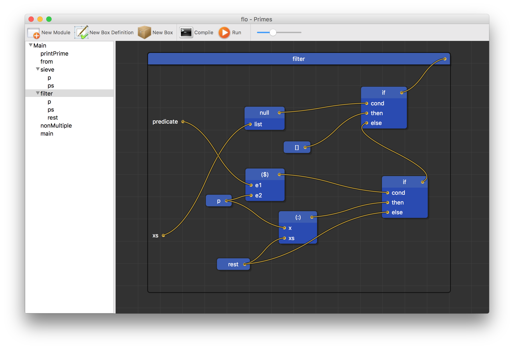

# flo
Flo is a visual, purely functional programming language. The syntax and semantics are heavily inspired by Haskell, whereas the visual editor is modeled after Quartz Composer. Flo features strong static typing, non-strict semantics, parametric polymorphism, algebraic data types, and other features commonly shared by purely functional languages, presented in a visual manner that is intuitive and extremely simple to learn.

#### Boxes and Cables
Flo's syntax is comprised entirely of boxes and cables. Boxes primarily represent functions, but they are also used for literals and constructors. Boxes may have a list of inputs, or they may have none if they are literals or constant applicative forms. Each box has an output, which is the expression the box returns.

Cables connect outputs to inputs. They represent a flow of values from one box to another. To apply a function to a set of values, simply connect the outputs of the values to the corresponding inputs on the function's box. Boxes can also be partially applied if not all inputs have cables connected to them. In particular, if you need to pass a function as an input to another function, attach a cable to the box's output, and don't apply any inputs to it.

#### Inputs
Box inputs have names which can provide helpful annotations. However, these names are essentially meaningless and are stripped away by the compiler. The only thing that really matters is the order of inputs.

#### Literals
Literals are represented as boxes with no inputs. The name of the box determines which kind of literal it is. Integers and floating point numbers are boxes with numbers for their names. Strings are surrounded by double quotes, while characters are surrounded by single quotes.

#### Box Definitions
When using boxes in expressions, they appear as black boxes. Inputs go in and an output comes out, but the internals are not visible. A box definition, however, defines the internals of a box. To use the box's inputs, hook them up to cables. The value of the box is equal to the expression that is connected to the box's output, just as you'd expect.

#### Local definitions
Box definitions can be arbitrarily nested, creating the equivalent of a let expression in Haskell. When a box definition occurs nested inside another box definition, the scope of the local definition is only for the box definition it is contained in.

#### Modules
Just as in other languages, a program can have multiple modules. The purpose of modules is to limit the scope of box definitions and support code reusability.

#### Types
Flo is strongly, statically typed, but type inference is performed so that type annotations are unnecessary. An important exception to this is when defining the types of fields in data constructors. To specify that an expression has a certain type, use the built-in function idMono, which is the monomorphic identity function. It takes two parameters, a type and an expression. It returns the seconds parameter unchanged, just like the regular identity function, but it forces it to have the type of the first parameter.

#### Data Constructors
Data constructors are defined like normal functions that are simply a wrapper around DataCons, a built-in data constructor. It also takes zero or more arguments and packages up its components into a new data type. Use idMono to annotate the type of the data constructor. Alternatively, if no type annotation is provided, the constructor will have the same type as the name of the surrounding box definition.
