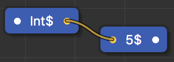
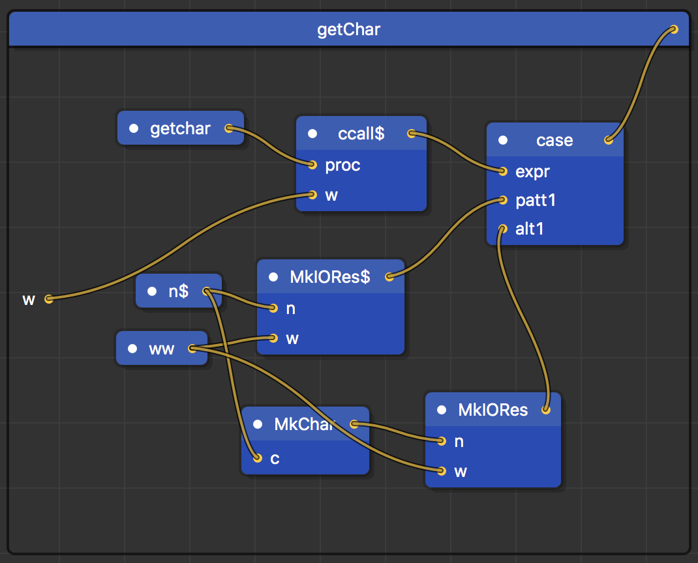

flo: A visual, purely functional programming language
=====================================================

Created by Elliott Lawrence

Overview
--------

Flo is a visual, purely functional programming language. The syntax and
semantics are heavily inspired by Haskell, whereas the visual editor is
reminiscent of Apple’s Quartz Composer. Some of flo’s features include
higher-order functions, parametric polymorphism, algebraic data types,
non-strict semantics, strong static typing, and other features commonly
shared by purely functional languages, presented in a visual manner that
is intuitive and easy to learn.

The goals of this project were threefold:

-   Design the language
-   Create a visual editor to write programs with
-   Create the compiler

The subsequent sections in this README explain details about the language
and how the project was implemented.

Language Syntax and Features
----------------------------

### Boxes


The most fundamental component of flo’s visual syntax is boxes, which
can represent functions, variables, literals, data constructors, and
types. Boxes have a name, a (possibly empty) list of inputs on the left,
and an output on the right. An example of the *plus* box, which adds two
numbers x and y, is shown at right. The input directly to the left of
the box name is used for type annotations (which will be explained
later).

### Inputs and Outputs

Boxes can have zero or more inputs, just like functions in other
languages. Box inputs can be given names as a convenience for the
programmer, but the names do not have to be consistent across multiple
instances of the same box, since they are ignored by the compiler.

The output of a box represents the value the box returns. Since flo
features higher-order functions, boxes can output other functions as
well as simple values.

### Cables

Cables are the second fundamental component of flo’s visual syntax. They
are used to connect the output of one box to the input of another, so in
a sense they represent a flow of data. In the picture shown below, the
numbers 4 and 3 are being input into *plus*. The result of the addition
is carried off by the cable coming out the other end of *plus*.


It is not necessary for all of a box’s inputs to have cables attached to
them. When this happens, the output is a partially applied function. So,
in the example below, the output of *plus* is a new function which takes
a single integer argument and adds 4 to it.


### Box Definitions

When used in expressions, boxes appear as “black boxes” with unspecified
implementations. The actual internals of a box are defined in its
so-called box definition, which can be accessed from the list of box
definitions on the left-hand side of the editor. The definition for the
Boolean *and* function is shown below. Note that the output of *if* is
being transmitted as the output of *and*.


### Modules

A program consists of a list of modules, and in turn, a module consists
of a list of box definitions. An example of a module structure for a
program is shown below. The topmost elements are modules, and all
sub-elements are box definitions.


Modules provide a convenient way to organize box definitions, but they
do not introduce any namespaces (as of now), as is the case with other
languages. In particular, it is not allowed to have two box definitions
with the same name in separate modules.

### Local Definitions

Box definitions can also have their own local box definitions (which can
be arbitrarily nested), whose scope is limited to the box definition
they are defined in. These correspond directly to let expressions in
functional languages. Local definitions can be added by clicking the
“New Box Definition” button on the toolbar while viewing the parent box
definition in the editor.

As an example, notice that in the picture above, *foldr* has a
local box definition called *foldrHelp*.

### Types

Boxes can also represent types. Types come in two forms:

-   Simple types, such as *Int*, *Char*, and *Bool*
-   Type constructors, which are essentially functions that take one or
    more types and return a new type. An example is *List* (shown
    below), which takes a type *a* and returns a new type representing a
    list of *a* values. Type constructors do not have box definitions,
    nor do they perform any computations at runtime. They are only used
    to annotate types of expressions and are discarded by the compiler
    after type checking is complete.


Type annotations can be added by connecting a type to the input directly
to the left of a box’s name. In the example below, *negate* is a
function that takes an integer and multiplies it by -1. Both *x* and the
output of *negate* are annotated as having type *Int*. Note that type
annotations always correspond to the type of a box’s output.


Flo features strong, static typing and uses the Hindley-Milner type
system. This means that adding explicit type annotations is optional,
since types for all expressions are inferred. Furthermore, the type
checker will always deduce the most general type for any function or
expression. One consequence of this is that a function that finds the
length of a list, for example, can handle a list containing integers, or
Boolean values, or any other type for that matter. Writing separate
functions to handle different types is unnecessary if they have
identical implementations.

### Data Constructors

Data constructors are essentially functions that have no implementation
and just package up their components into a new data type. Data
constructors are defined using the built-in function *DataCons*, which
takes a variable number of components and returns a new data type having
the same name as the surrounding box definition.

### 

The definition for *Cons*, which represents an element of a linked list,
is shown above. *Cons* has two components, the head and tail of a list.
Notice that *head* is annotated as having type *a* (which is a type
variable and could be anything), and *tail* is annotated as being a List
of *a* values. In other words, a *Cons* cell is an element of a
homogeneous list. The values *head* and *tail* are then input into
*DataCons*, which packages up the components and returns the resulting
*Cons* cell, which is also annotated as being a List of *a* values.

A data constructor need not have any components, as shown below in the
definition for *True* (which is perhaps surprisingly not built into the
language). In this case, *True* is simply defined as being a value of
type *Bool*.


### Literals

Literal values are represented as boxes which contain no inputs. The
name of the box determines what type of literal it is:

-   A name surrounded in double quotes is a
    *String*.
-   A single character surrounded in single quotes is a *Char*.
-   An integer is simply an *Int*.
-   A number with a decimal point is a *Float*.


### Boxed and Unboxed Values

For technical reasons, flo makes a distinction between boxed and unboxed
values. Unboxed values are the “actual” values that can be manipulated
by the instruction set of the machine, whereas boxed values consist of
an unboxed value wrapped up by an application of an appropriate data
constructor.

Unboxed values can be integers, floating point numbers, or strings.
Unboxed literals are denoted by a box with no inputs, whose name is the
literal value with a dollar sign appended to it. In the example below,
*5$* is the unboxed integer 5, and it has type *Int$*.



Boxed values are created by applying a data constructor to an unboxed
value. Below is the definition for *MkInt*, which takes an unboxed
*Int$* as an argument and packages it up into a data type of type
*Int*. Note that while *Int$*, the type of unboxed integers, is
built-in to the language, the type *Int* is not. It is defined by the
code below as the type of whatever *MkInt* returns.


Now, *MkInt* can be used as follows to create the boxed integer 5:


As it turns out, functions that exhibit parametric polymorphism cannot
accept unboxed values as arguments due to the special way they are
handled by the compiler. For this reason, boxed values are intended to
be used a majority of the time. In fact, the literal *5* is translated
by the compiler into an application of *MkInt* to *5$*, so the code
immediately above and below are equivalent.


The literals described in the previous section are all boxed and are
desugared by the compiler in a similar fashion.

### Primitive Functions

Certain arithmetic and Boolean operators are built-in to the language
(they are specially recognized by the compiler) and operate over unboxed
values. These so-called primitive functions are as follows: +$, -$,
\*$, /$, %$, ==$, and &lt;$. Ignoring the dollar signs, these
operators are the same as the operators in C.

Since unboxed values are not intended to be used very often, neither are
these primitive functions. Instead, their non-primitive counterparts
*plus*, *minus*, *multiply*, *divide*, etc. are much more useful since
they operate over boxed values instead. The definition for *plus* is
shown below.


*Plus*, as well as the other arithmetic functions, is defined in terms
of a more general function *primArith* (shown below), which takes a
primitive operator and two boxed numbers as arguments. It unboxes the
numbers, applies the operator to them, and then boxes up the result. The
code below uses case expressions, which are explained later. Note that
in the definition for *plus*, since *+$* does not have any cables
connected to its inputs, the actual function *+$* is being passed as an
argument to *primArith*.


### Case Expressions

Just as data constructors are used to package up their components, case
expressions are used to extract them. The first input to the built-in
*case* function is an expression to evaluate. The remaining inputs are
pairs that consist of a particular data constructor and an expression to
return if the original expression matches that constructor.

The definition for *if* is shown below. First, the condition is
evaluated. If the condition turns out to be true, the *then* expression
is returned. Otherwise, the *else* expression is returned.

### 

Case expressions can also serve to evaluate primitive functions. In the
example below, the expression 3 + 4 is evaluated. The result will not be
a data constructor, but rather an unboxed integer, which is denoted with
the name *t$*. This form of case expression is not intended to be used
very often, but it is used in the definition of *primArith*, which was
shown earlier.


### IO

Input and output are implemented with the same technique used by
Haskell, namely, monadic IO. An IO action is a function that takes a
value of type World and returns a data constructor *MkIORes*, whose
components are the result of the computation and the new world value.

IO actions can be composed to form larger, more complicated IO actions.
In fact, the *main* function (which is the entry point of every program)
is a single, potentially huge IO action. The two most important
combinators are *return*, which returns a regular value as an IO value,
and *bind*, which executes two IO actions in sequence, with the output
of the first action being used as input to the second action.

Some examples of IO actions are *getChar* and *putChar*, which get a
character from standard input and print a character to the console,
respectively. They are implemented using a special primitive function
*ccall$,* which can call an arbitrary function in C. The parameters to
*ccall$* are the literal name of the C function to call, the arguments
to the function, and the current world value. The function is actually
called by evaluating it with a case expression. The result of *ccall$*
is an application of the *MkIORes$* data constructor, which contains
the integer return value of the function that was called, along with the
new world value.

The definition for *getChar* is shown below. First the C function
*getchar* is called using *ccall$.* The result, *n$*, is an unboxed
integer representing the ASCII value for the character that was just
retrieved. This value is converted into a boxed character by sending it
through the *MkChar* data constructor. The resulting character and world
value are packaged up with *MkIORes*, which is the final return value
for *getChar*.



*ccall$* is a useful but dangerous primitive. On the one hand, its
power means that the entire IO subsystem can be defined within flo
itself and extended without requiring changes to the compiler, but when
used irresponsibly it can violate the functional purity. For this
reason, it is not intended to be used outside of the IO subsystem, and
even then there is a burden of proof on the programmer to show that any
side effects do not affect the behavior of the rest of the program.

Editor Features
---------------

### Editor Overview

A screenshot of the editor is shown below. The toolbar at the top has
buttons for some commonly used actions. The tree view on the left-hand
side displays a list of modules and box definitions. The center area is
called the canvas, and it displays the box definition for the currently
selected item in the tree view.


### Default Library

Many of the functions mentioned in this paper and other common ones are
included in the default library that is automatically loaded every time
the flo editor is run. This includes standard list-processing functions,
common data type definitions, arithmetic operators, and IO functions and
combinators.

### Toolbar

The toolbar contains the following items:

-   The “New Module” button adds a new module to the program.

-   The “New Box Definition” button creates a new box definition. If the
    currently selected item in the tree is a module, a box definition is
    added to the module, and if the currently selected item is a box
    definition, then a new local box definition is added.

-   The “New Box” button adds a new box to the canvas.

-   The “Compile” button compiles the program. The output of the
    compilation will be displayed in the console, including any errors
    or warnings.

-   The “Run” button executes the program.

-   The slider zooms in and out on the canvas.

### Editing Boxes

Box names can be changed by double clicking their name and editing the
text.

Inputs can be added by double clicking anywhere on the box where there
isn’t text. Double clicking an input’s name and clearing the text will
delete the input from the box.

Editor Implementation
---------------------

### MVC

The graphical editor is implemented in Java using the Standard Widget
Toolkit (SWT), and the system architecture is based on the Model View
Controller (MVC) pattern. The breakdown of the model, view, and
controller are as follows:

-   The controller consists of the Observer interface and Observable
    class, which handle events and event listeners. There are classes
    for various types of events that occur during editing, such as
    BoxAddedEvent, BoxDefinitionRemovedEvent, ModuleRenamedEvent, and
    so on.

-   The model consists of the program that’s being edited. Its
    representation is described in more detail later. The classes that
    make up the model primarily extend Observable.

-   The view consists of the GUI components, which primarily
    implement Observer. These components listen for changes in the model
    (they “observe” the “observables”) and are immediately updated to
    reflect those changes.

### FloGraph

Various components of programs have a direct correspondence to classes
in Java. For example, there are classes called Module, BoxDefinition,
Cable, Input, and Output, which represent exactly what you’d expect.
Programs are represented as instances of the class FloGraph, which is a
composition of the classes just mentioned.

This underlying representation of a program is modified as the
programmer makes changes in the editor. When the program is saved as a
.flo file, the FloGraph object (and its components) is serialized into a
JSON format. When a .flo file is opened, the editor parses the JSON data
and constructs a FloGraph object out of it.

### Tree

The tree view on the left-hand side of the editor stays current by
simply attaching itself as a listener to the current FloGraph object.
Any time a module or box definition is added, removed, or renamed, an
event is triggered and the tree updates itself accordingly.

### Canvas

The canvas has various methods for drawing different visual components,
such as drawBox(), drawInput(), and drawCables(), and it also has
methods for calculating sizes, such as calculateBoxSize().

The canvas also has listeners for various types of events, such as
whenever the current box definition changes, whenever the user clicks
and drags, and whenever the user double clicks. To keep track of what
parts of the canvas the user can click on or interact with, the canvas
has a list of “hotspots.” If the user double clicks on a certain type of
hotspot, for example, an event associated with that hotspot is
triggered, whereas if the user double clicks on an empty part of the
grid, nothing happens since there is no hotspot there.

The Compiler
------------

### The Compilation Process

The compiler is written in Haskell and carries out a series of
transformations to turn a .flo file into an executable. These steps are
explained in greater detail in subsequent sections, but the general
outline is as follows:

-   A .flo file is parsed into the FloGraph data type.
-   FloGraph is converted into the FloProgram data type.
-   From here, the compiler can take either of two alternatives:
    -   Compile to Haskell
        -   FloProgram is converted to the HaskellProgram data type.
        -   HaskellProgram is printed out as Haskell source code and the
            Haskell compiler is run.
    -   Compile to C
        -   Type checking is performed.
        -   FloProgram is converted to the STG data type.
        -   STG is converted into the AbstractC data type.
        -   AbstractC is printed out as C source code and gcc is run,
            which generates the final executable.

### FloGraph

First, the compiler loads up a .flo file (which is really just JSON) and parses it into the FloGraph
data type. This data type is similar to the FloGraph class in the
editor, with a few minor differences. Irrelevant information such as box
locations on the canvas is discarded, but otherwise, no major
transformations are made.

### FloProgram

Next, the FloGraph is converted into the FloProgram data type. Whereas
FloGraph represents a program in terms of its visual components (boxes,
cables, etc.), a FloProgram represents a program in terms of functions
and expressions (in other words, it represents the abstract syntax tree
of the program). The translation is relatively straightforward given the
interpretation of the visual syntax in previous sections. Essentially,
to convert a box definition to a function definition, start from the
output and follow the cable until a box is reached. The box will be
translated to a certain type of expression depending on what it is
(*case, DataCons*, a primitive function, or a regular box). In order to
create this expression, the box’s inputs must also be converted into
expressions, so the cables attached to those inputs are followed, and
the process continues until all the boxes and cables in the box
definition have been traversed.

### HaskellProgram

The first alternative the compiler can take is to convert everything to
Haskell. I implemented this route for testing purposes before I had
finished the “proper” compiler, but this method of compilation can be
useful in its own right since it allows programs written in flo to use
any Haskell library functions.

The translation consists of converting the FloProgram data type into the
HaskellProgram data type, which represents the abstract syntax tree for
Haskell code. This conversion is extremely simple, as there are only
minor differences between the two data types. A HaskellProgram can then
be printed out to generate Haskell source code, and the Haskell compiler
is run to generate the final executable.

### Type Checking

The second alternative the compiler can take is to convert everything
into C, which is the “official” compilation process.

The next step in this process is type checking. The type checker takes
an abstract syntax tree and attempts to infer types for all expressions
in the program, and the algorithm it uses is called Algorithm W. The
type checker is capable of inferring the most general type of an
expression (allowing for parametric polymorphism), and it will throw an
error if a particular expression is inferred to have two incompatible
types. As of now, the type checker is only partially implemented, so it
is not currently being run. So far, the type checker is capable of
inferring types for arbitrary expressions, but it cannot yet handle type
checking for an entire program, which may include user-defined data
types.

### STG

There are many ways to implement lazy functional languages, but the
particular implementation I chose is called the Spineless Tagless
G-machine (STG), which is described in a paper by Simon Peyton Jones
(1992). The STG machine is also what the Haskell compiler uses (or at
least, a modified, more complicated version of it).

The next step in the compilation is to convert the FloProgram data type
into STG, which is a simple functional language designed specifically
for the STG machine. The STG language has only the following types of
expressions:

-   Function applications, which are self explanatory. One of the
    restrictions that STG imposes is that function arguments have to be
    either simple variables or literal values, so nested function calls
    are not allowed.

-   Let expressions, which allow expressions to have their own local
    variable or function definitions. Let expressions are a ubiquitous
    construct in functional languages.

-   Case expressions, which evaluate data constructors or primitive
    values and switch to an appropriate code segment based on
    the result. These are analogous to switch statements in
    imperative languages.

-   Data constructor applications, which are similar to
    function applications. The same restriction as before applies, in
    that all data constructor arguments must be simple variables
    or literals. In addition, data constructors cannot be partially
    applied; they must accept all their arguments at once (flo does not
    have this restriction).

-   Primitive (built-in) operations, such as *+$, -$, &lt;$,
    ==$,* etc. As with data constructors, these operators also cannot
    be partially applied.

-   Literal values, such as 3, 6.7, etc.

The general transformation of FloProgram into STG consists of the
following steps:

-   If a data constructor or built-in operation is partially applied, a
    new function binding is created which accepts any remaining
    arguments and applies them to the constructor or operator. For
    example, using Haskell syntax, the partial application Cons x is
    converted into f xs = Cons x xs.

-   Function arguments which are not simple variables or literals are
    given a name, which is defined in a newly-introduced let expression
    that surrounds the function application. For example, the function
    application f (g x) would be converted into: let {y = g x} in f y.

-   Function bindings are annotated with a list of variables that appear
    free in their definition. For example, in the function definition f
    x = x + y, y would be a free variable since it is not an argument to
    the function. The concept of free variables in this sense is
    borrowed from the lambda calculus.

-   Variables which are bound by a let expression are given a name that
    is unique within the entire program. This is necessary because two
    different let expressions could define the variable x, which would
    cause a name clash when code is finally generated.

### AbstractC

The final step is to convert STG code into the AbstractC data type,
which represents the abstract syntax tree for C. This data type can be
printed out to generate C code, at which point gcc can be run to compile
the code into the final executable.

C is used as the target language primarily because it is portable (gcc
can be run on many different platforms), and it is treated by the STG
implementation essentially as a high-level assembler. The stack and heap
are mapped to explicit arrays, and function arguments are passed via the
stack instead of the usual mechanism used by C. Global variables are
used to simulate different registers, such as the stack and heap
pointers.

### The Tiny Interpreter

The execution of the program is controlled by a tiny interpreter in
main(), shown below. The variable *cont* is initialized to point to the
function main\_entry(), which is the entry point of every program. In
general, *cont* points to the function to call next. In the while loop,
this function is called, and it returns the address of the next function
to call, which is assigned to cont. This process repeats until *cont* is
assigned the address of main(), at which point execution stops.

```
int main() {
  function f\_main = (function)main;
  function cont = main\_entry;
  while (cont != f\_main) {
    cont = (function)(\*cont)();
  }
  return 0;
}
```

### The Heap

The heap is a collection of closures, which are contiguous blocks of
memory that contain information about different functions, variables,
and data constructors in the program. The first word of every closure is
the info pointer, which points to the C function that is generated for
that particular language construct (more about code generation later).
Followed by this is a series of pointers which point to either the free
variables that are used by the function or variable, or the fields of
the data constructor. Finally, there is a series of non-pointer words,
which represent literal values (such as integers). Note that a boxed
integer is represented as a closure in the heap containing a field whose
value is the unboxed integer.

### The Stacks

There is one array allocated for stack space, but it actually consists
of two stacks that grow towards each other. The A stack is used for
pointers, whereas the B stack is used for unboxed values as well as
return addresses (described later).

### Code Generation

This section describes the code that is generated for each construct in
the STG language.

-   Top-level function definitions: First, the body of the function
    is compiled. Then, a closure is created for the function, but
    instead of it being allocated in the heap, it is statically
    allocated as a C array.

-   Function applications: First, the arguments to the function are
    pushed onto the appropriate stacks (A stack if the argument is a
    pointer, B stack if the argument is an unboxed value). The stack
    pointers are then adjusted, and the address of the function to call
    is returned.

-   Let expressions: Each of the bindings in a let expression is
    compiled into a separate C function in the same way that top-level
    function definitions are compiled. The actual code for a let
    expression consists of the following: First, space is allocated in
    the heap to create a closure for each of the let bindings. The
    closures are then filled in with the addresses of their free
    variables, as well as any unboxed values they may need. Followed by
    this is the code for the body of the let expression.

-   Case expressions: Case expressions consist of an expression to
    evaluate and a series of alternative code paths which could possibly
    be taken.

    -   The alternatives are compiled into a separate C function
        containing a switch statement. Each data constructor in the
        program is given a unique integer ID, and this ID will be
        assigned to the global variable RTag when the case expression
        has been evaluated. The switch statement selects a case based on
        the value of RTag, and each case contains the code that is
        compiled for that particular alternative. For case expressions
        that evaluate primitive operations, instead of switching on
        RTag, they switch on the result of the operation, which is
        stored in the global variable IntReg if the result is an
        integer, for example.

    -   The code generated for the actual case expression is as follows:
        First, any variables in the heap used by the alternatives are
        saved on the stacks (since a variable’s offset from the heap
        pointer may change by an unpredictable amount after an
        expression is evaluated). Next, the address of the function
        containing the code for the alternatives (the so-called
        return address) is pushed onto the B stack. Followed by this is
        the code generated for the expression that is to be scrutinized.

-   Data constructors: Each data constructor is compiled into its own C
    function that simply pops off a return address from the B stack and
    jumps to it.

-   Primitive operations: First, the appropriate operation is performed,
    and the result is saved in a global variable. For example, if 3 + 4
    is being evaluated, the result, 7, would be stored in the global
    variable IntReg. A return address is then popped off the B stack,
    and control continues at this address.

-   Literal values: The literal value is stored in an appropriate global
    variable, such as IntReg if the literal is an integer. As with
    primitive operations, a return address is then popped off the B
    stack and jumped to.

-   ccall$: As mentioned before, ccall$ is the only extra thing the
    compiler needs to handle in order for input and output to work. It
    is translated very simply into a direct call to a function in C. The
    result of this function call is stored in the data
    constructor MkIORes$. For the function *getchar*, for example, the
    value that is returned is the ASCII code for the character that
    was retrieved.
